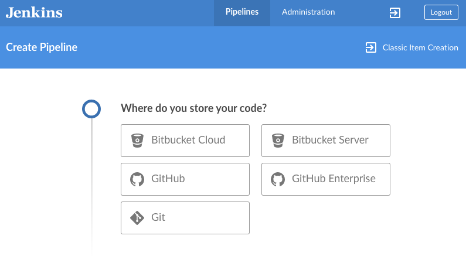
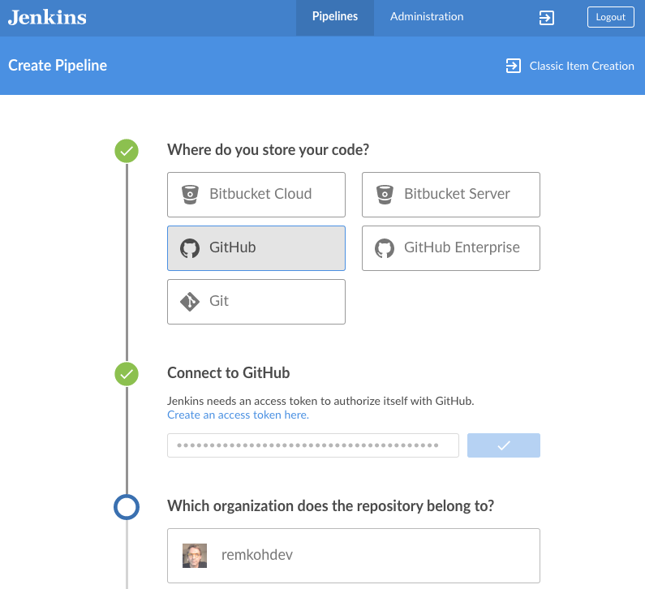

# Deploying a Spring Boot App using with Jenkinsfile Using Source-to-Image (S2I) in Jenkings on Openshift

1. Create a fork of the `spring-client` repository,

	* Go to https://github.com/remkohdev/spring-client,
	* Create a fork in your own GitHub organization, e.g. https://github.com/<username>/spring-client

2. Review Jenkinsfile,

	* Review the Jenkinsfile that is included in the Spring Client repository,

 
3. Create a Personal Access Token to Access the Github API

	* Go to your Github account > Settings > Developer settings > [Personal access tokens](https://github.com/settings/tokens),
	* Click `Generate new token`,
	* Under `Note` add `github-access-token-for-jenkins-on-openshift`,
	* Select the scopes for `repo`, `read:repo_hook`, and `user`,
	* Click `Generate token`,
	* Copy the token, we need it to create our Jenkins pipeline,

4. Create a Multibranch Pipeline using Blue Ocean,

	* In the Jenkins Dashboard, click `Open Blue Ocean` to open the Blue Ocean editor,
	* In the `Welcome to Jenkins` popup window, click the `Create a new Pipeline` button, or click the `New Pipeline` button,

		

	* This will create a new `Multibranch Pipeline`,
	* Select the `GitHub` option,

		

	* In the `Connect to GitHub` section, paste the personal access token you created in your Github account,

		

	* Click `Connect`,
	* Select the organization to where you forked the Spring Client repository,
	* Search for and select the `spring-client` repo,
	* Click `Create Pipeline`,

	* When the pipeline creation is completed, a build is triggered automatically,

		

	* Click the Configure option,
	* Review the settings,

Jenkins agent pods, also known as slave pods, are deleted by default after the build completes or is stopped.

OpenShift Container Platform provides three images suitable for use as [Jenkins slaves](https://docs.openshift.com/container-platform/3.11/using_images/other_images/jenkins_slaves.html): the Base, Maven, and Node.js images. The first is a base image for Jenkins agents:

* It pulls in both the required tools (headless Java, the Jenkins JNLP client) and the useful ones (including git, tar, zip, and nss among others).
* It establishes the JNLP agent as the entrypoint.
* It includes the oc client tooling for invoking command line operations from within Jenkins jobs.
* It provides Dockerfiles for both CentOS and RHEL images.

Two more images that extend the base image are also provided:
* Maven v3.5 image
* Node.js v8 image

f90452936e67969d105d08625c46347a5e6a82b8

echo 'Deploy application'
sh 'oc version'
sh 'oc delete project springclient-ns'
sh 'oc new-project springclient-ns'
sh 'oc project springclient-ns'
sh 'oc new-build --strategy docker --binary --docker-image openjdk:8-jdk-alpine --allow-missing-images=true --name springclient'
sh 'oc start-build springclient --from-dir . --follow'
sh 'oc new-app springclient'
sh 'oc expose svc/springclient'

                    openshift.newApp(
                    	"redhatopenjdk/redhat-openjdk18-openshift~https://github.com/remkohdev/springclient",
                    	"--name=springclient",
                    	"--strategy=source",
                    	"--allow-missing-images=true",
                    	"--build-env=JAVA_MAIN_CLASS=hello.Application")
                    {
                      echo 'new app springclient created'
                    }

oc new-app 'java:8~https://github.com/remkohdev/springclient' --allow-missing-images --strategy=source --build-env='JAVA_MAIN_CLASS=hello.Application' -l app=springclient

oc expose svc/springclient

oc delete buildconfigs.build.openshift.io "springclient"
oc delete deploymentconfigs.apps.openshift.io "springclient"
oc delete imagestreamtag.image.openshift.io "springclient:latest"
oc delete service springclient
oc delete routes.route.openshift.io "springclient"

oc import-image java:8 --from=registry.access.redhat.com/redhat-openjdk-18/openjdk18-openshift --confirm

sh 'oc project springclient-ns'
sh 'oc new-app \'java:8~https://github.com/remkohdev/springclient\' --allow-missing-images --strategy=source --build-env=\'JAVA_MAIN_CLASS=hello.Application\''
sh 'oc expose svc/springclient'

oc login https://c100-e.us-south.containers.cloud.ibm.com:30403 --token=0Z-kt0LcydPTjfFg2CYN7Fv2zqiyNIc1GswwVx_gqG8

sh 'oc delete project springclient-ns'
sh 'oc new-project springclient-ns'

https://github.com/openshift/jenkins-client-plugin
https://blog.openshift.com/building-declarative-pipelines-openshift-dsl-plugin/
http://people.redhat.com/jrivera/openshift-docs_preview/openshift-online/glusterfs-review/dev_guide/dev_tutorials/openshift_pipeline.html
https://ruddra.com/posts/openshift-python-gunicorn-nginx-jenkins-pipelines-part-two/

pipeline {
	agent {
		label 'maven'
	}  
	stages {
	  stage('Setup') {
        steps {
        	withCredentials([usernamePassword(
	          	credentialsId: 'openshift-login-api-token', 
	          	usernameVariable: 'USERNAME',
	        	passwordVariable: 'PASSWORD',
	        )]) {
            	script {
                  sh "oc login https://c100-e.us-south.containers.cloud.ibm.com:30403 --token=${PASSWORD}"
                  sh 'oc import-image openjdk18-openshift:latest --from=registry.access.redhat.com/redhat-openjdk-18/openjdk18-openshift --confirm'
                }
	        }
            script {
              openshift.withCluster() {
                echo "Using project: ${openshift.project()}"
              }
            }
        }
      }
      stage('Clean') {
        steps {
          withCredentials([usernamePassword(
          	credentialsId: 'openshift-login-api-token', 
          	usernameVariable: 'USERNAME',
        	passwordVariable: 'PASSWORD',
          )]) {
            	script {
                  sh "oc login https://c100-e.us-south.containers.cloud.ibm.com:30403 --token=${PASSWORD}"
                  sh 'oc delete project springclient-ns'
                }
          }
        }
      }
	  stage('Checkout') {
		steps {
			echo 'Checkout source code'
			checkout scm
			script {
			  def pom = readMavenPom file: 'pom.xml'
			  def version = pom.version
			}
		}
	  }  
	  stage('Maven Build') {
		steps {
			echo 'Build jar file'
			sh 'mvn clean install -DskipTests=true'
		}
	  }
	  stage('Unit Tests') {
		steps {
			echo 'Run unit tests'
			sh 'mvn test'
		}
	  }
	  stage('Create Project') {
	  	steps {
	  		script {
	  			openshift.withCluster() {
	  				sh 'oc new-project springclient-ns'
	  			}
	  		}
	  	}
	  }
	  stage('Deploy') {
		steps {
			echo 'Deploy application'
			script {
                openshift.withCluster() {
                	  sh 'oc project springclient-ns'
                	  sh 'oc new-app \'redhat-openjdk-18/openjdk18-openshift:1.6~https://github.com/remkohdev/spring-client\' --allow-missing-images --strategy=source --build-env=\'JAVA_MAIN_CLASS=hello.Application\' -l app=springclient'
                }
            }
		}
	  }
	  stage('Expose') {
		steps {
			echo 'Expose Route'
			script {
                openshift.withCluster() {
                	  sh 'oc expose svc/springclient'
                }
            }
		}
	  }
	}
}

	  stage('New Build') {
	  	steps {
	  		script {
	  			openshift.withCluster() {
	  				sh 'oc new-build --name=springclient --image-stream=openjdk18-openshift:latest https://github.com/remkohdev/spring-client.git'
	  			}
	  		}
	  	}
	  }