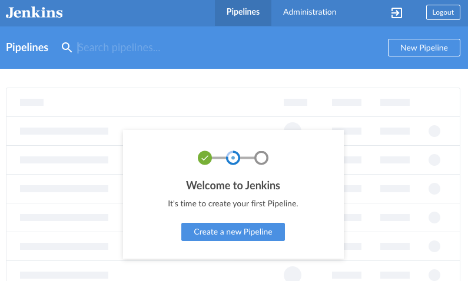
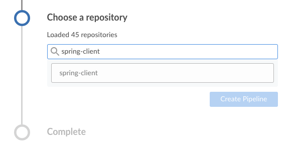

# Deploying a Spring Boot App using with Jenkinsfile Using Source-to-Image (S2I) in Jenkings on Openshift

1. Create a fork of the `spring-client` repository,

	* Go to https://github.com/remkohdev/spring-client,
	* Create a fork in your own GitHub organization, e.g. https://github.com/<username>/spring-client

2. Review Jenkinsfile,

	* Review the Jenkinsfile that is included in the Spring Client repository,

 
3. Create a Personal Access Token to Access the Github API

	* Go to your Github account > Settings > Developer settings > [Personal access tokens](https://github.com/settings/tokens),
	* Click `Generate new token`,
	* Under `Note` add `github-access-token-for-jenkins-on-openshift`,
	* Select the scopes for `repo`, `read:repo_hook`, and `user`,
	* Click `Generate token`,
	* Copy the token, we need it to create our Jenkins pipeline,

4. Create a Multibranch Pipeline using Blue Ocean,

	* In the Jenkins Dashboard, click `Open Blue Ocean` to open the Blue Ocean editor,
	* In the `Welcome to Jenkins` popup window, click the `Create a new Pipeline` button, or click the `New Pipeline` button,

		

	* This will create a new `Multibranch Pipeline`,
	* Select the `GitHub` option,

		

	* In the `Connect to GitHub` section, paste the personal access token you created in your Github account,

		

	* Click `Connect`,
	* Select the organization to where you forked the Spring Client repository,

		

	* Search for and select the `spring-client` repo,
	* Click `Create Pipeline`,

	* When the pipeline creation is completed, a build is triggered automatically,

		

	* Immediately, a build is triggered,
	* If you're interested, review the pipeline settings:
    	* Click the Configure option,
    	* Review the settings,

## Background 

Jenkins agent pods, also known as slave pods, are deleted by default after the build completes or is stopped.

OpenShift Container Platform provides three images suitable for use as [Jenkins slaves](https://docs.openshift.com/container-platform/3.11/using_images/other_images/jenkins_slaves.html): the Base, Maven, and Node.js images. The first is a base image for Jenkins agents:

* It pulls in both the required tools (headless Java, the Jenkins JNLP client) and the useful ones (including git, tar, zip, and nss among others).
* It establishes the JNLP agent as the entrypoint.
* It includes the oc client tooling for invoking command line operations from within Jenkins jobs.
* It provides Dockerfiles for both CentOS and RHEL images.

Two more images that extend the base image are also provided:
* Maven v3.5 image
* Node.js v8 image

